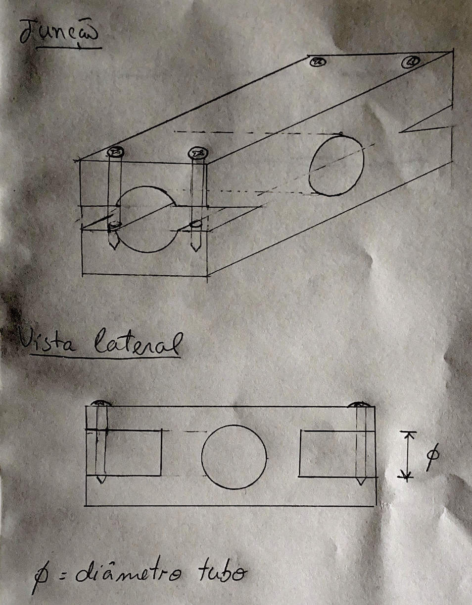

# Last Week Progress

Last week our plan was to:

1. Control the motor with the arduino

2. Test the MPU6050 IMU sensor and properly identify how it operates (what are it's outputs and how to work with it)

3. Ask the professor to manufacture the joint.

First of all, we sent a scketch of the joint to the professor so that it could be manufactured:

In addition to that we also controlled the motor speed using the arduino code in the github. 

The professor did not yet have the MPU6050 IMU sensor but he said that he will buy it in the provided link: 
https://www.ptrobotics.com/acelerometros/3639-triple-axis-accelerometer-gyro-mpu-6050.html

# To-do

We realized that the arduino microcontroller does'nt have support to the tensorflowLite module, so we will change to a esp32 Pico board.

1. Write the ESC callibration code in micropython:
https://docs.micropython.org/en/latest/library/pyb.html

