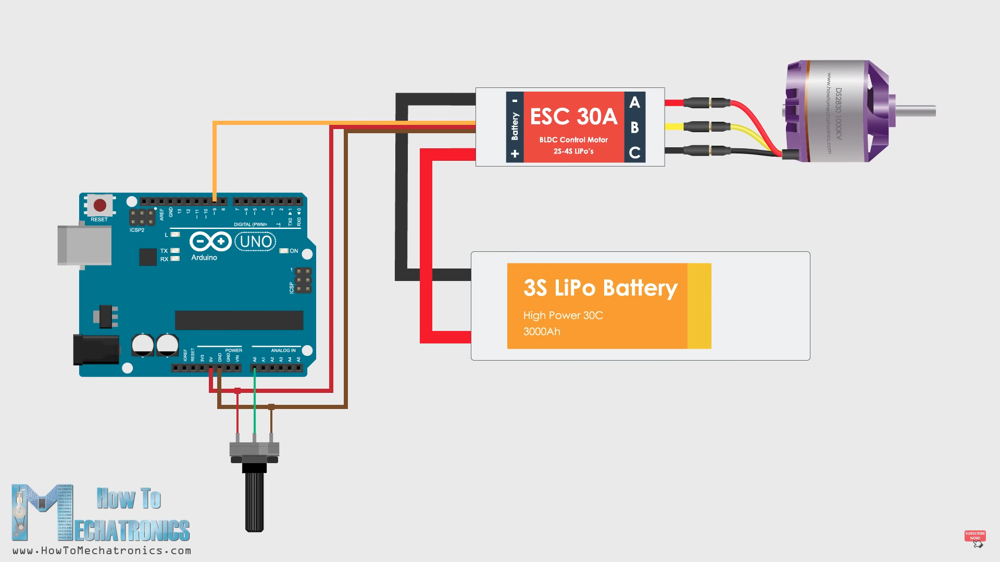
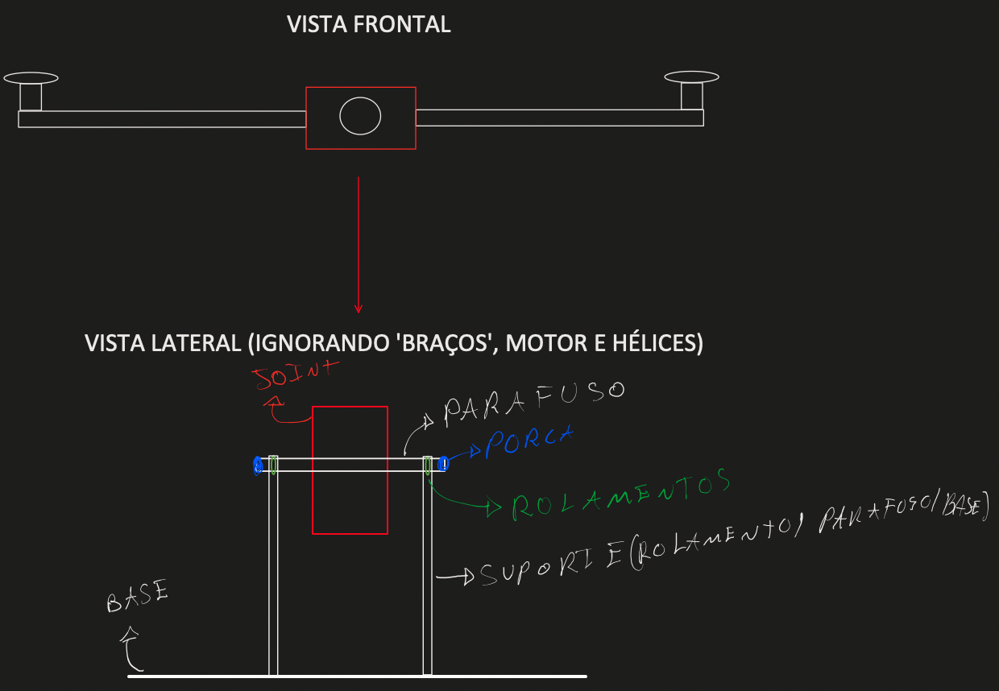

# Plan to the class

1. Control the motor with the arduino

2. Test the MPU6050 IMU sensor and properly identify how it operates (what are it's outputs and how to work with it)

3. Ask the professor to manufacture the joint.

# Work Before Class 

1. Continue to gather useful references and indentify/test virtual environments to train the RL Agent

2. Design the joint to be manufactured (if we can find the mesurements online, otherwise we have to mesure it and design during class)

# Work During Class

## 1 - Control the motor with Arduino

As we have seen last week the ESC properly converts a voltage input to motor speed control linearly. 

A guide on how it works and how to control: https://www.youtube.com/watch?v=uOQk8SJso6Q

### 1.1 - Setup at fixed voltage

In the referenced video it is used a potentiometer so that the voltage can be changed manually resulting in a manual controll of the output thrust of the motor. 

As a first step I suggest we take a more conservative and simple approach, to get more confident with the material. To do so, instead of using a potentiometer we should go with a fixed voltage and see how it works.

### 1.2 - Potentiometer

Although our final goal is not to controll the motor manually but rather with no human input, it could be of great value adding a potentiometer to easily make some tests at different voltages input and collect some datapoints on the motor performance, since we don't have a very in-deep datasheet about it.

### 1.3 - Automatically control the voltage output

Going fowards our final goal we should define how to properlly control the voltage input without a (manual) potentiometer. (no ideal yet, should search for references...)

## 3 - Joint Manufacture

Sugestion (after we take the mesures I can design a final version o CAD):

