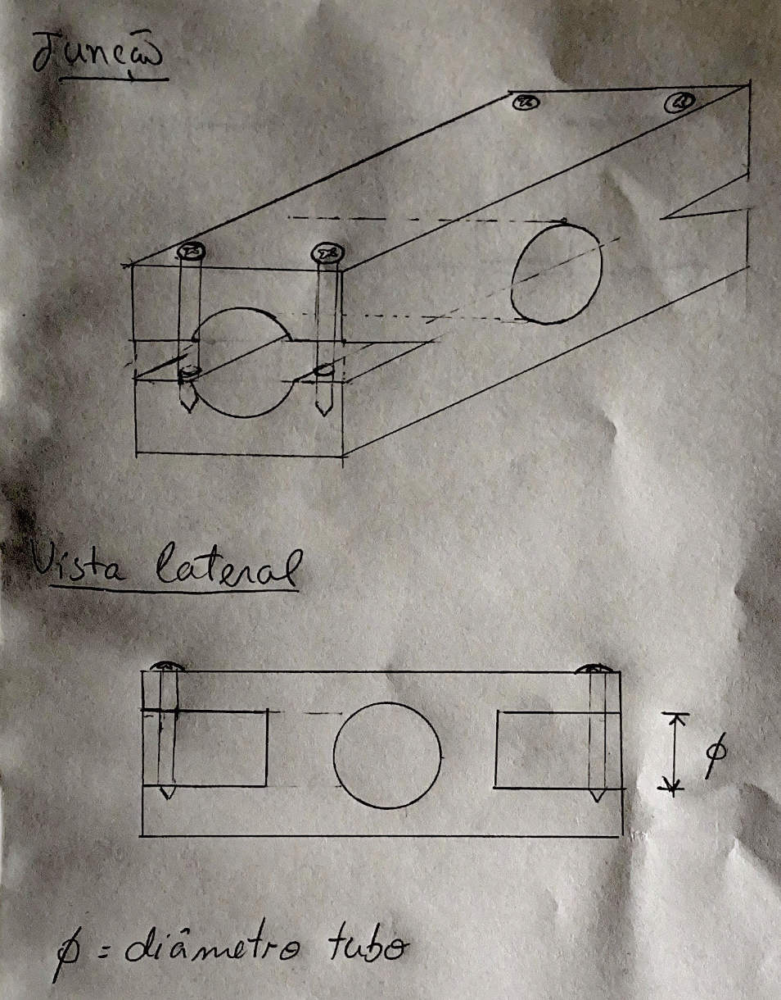

# Last Week Progress

Last week our plan was to:

1. Control the motor with the arduino

2. Test the MPU6050 IMU sensor and properly identify how it operates (what are it's outputs and how to work with it)

3. Ask the professor to manufacture the joint.

First of all, we sent a scketch of the joint to the professor so that it could be manufactured:

